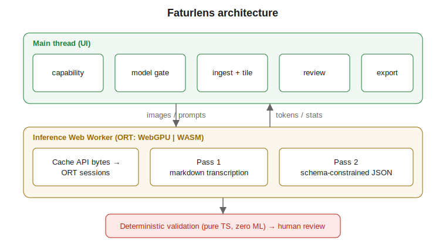

# Faturlens

[](./LICENSE)
[](https://github.com/YASSERRMD/Faturlens/actions/workflows/ci.yml)

Browser-native invoice OCR and structured extraction. A transformer
vision-language model (`LiquidAI/LFM2.5-VL-1.6B-ONNX`) runs **fully client-side**
via WebGPU, with a WASM CPU fallback. No server, no API, no data leaves the
machine — the app is offline-first (installable PWA) after the one-time model
download.

## Architecture



A two-pass pipeline runs entirely in a dedicated Web Worker: **Pass 1**
transcribes the whole invoice to Markdown; **Pass 2** extracts schema-constrained
JSON. A deterministic, zero-ML validation layer then gates every result and
routes anything suspect to human review.

## Feature overview

- Drag-in PNG / JPEG / WebP / PDF (≤25MB, ≤20 PDF pages), EXIF-corrected, tiled.
- Client-side VLM inference (WebGPU, WASM fallback) in an isolated worker.
- Confidence-annotated extraction with a deterministic validation layer (TRN/VAT,
  arithmetic, dates, currency).
- Split review UI: zoomable page image, live re-validation on edit, approval
  gating, edit audit trail.
- Export to canonical JSON (with provenance), CSV (header + line items), clipboard
  TSV, or a batch zip — gated on approval.
- Batch queue + IndexedDB persistence; sessions restore with no network and no
  reprocessing.
- Installable, offline-first PWA.

## Hardware targets

| Path     | Hardware                                            | Throughput (measure on your machine) |
| -------- | --------------------------------------------------- | ------------------------------------ |
| Primary  | 16GB RAM laptops, integrated GPU (Iris Xe / Radeon) | WebGPU EP — seconds per page         |
| Fallback | CPU-only browsers                                   | WASM EP — minutes per page           |

> Throughput is reported live in the app's stats drawer; the warmup benchmark
> shows an upfront per-page estimate before processing. (Populate this table with
> your reference numbers from a real run.)

The browser tab memory ceiling is treated as a hard 4GB budget; the app aborts
gracefully beyond it.

## Privacy

Zero network calls after the model download, except explicit Hugging Face CDN
fetches during caching. No telemetry, no analytics, no external fonts, no
runtime CDN scripts. The service worker never intercepts HF CDN requests.

## Development

```bash
npm ci
npm run dev        # dev server
npm run typecheck
npm run lint
npm run test
npm run build
npm run ci         # all of the above
```

Requires Node 22 (see `.nvmrc`).

### Dev/diagnostic flags (query params)

- `?diag` — device capability report card.
- `?harness` — inference dev harness (prompt + image, streaming output, stats).
- `?model` — force the model download gate.

## Releasing

CI runs typecheck/lint/test/build on every PR. Pushing a `v*` tag builds and
attaches the `dist` bundle to a GitHub release (`.github/workflows/release.yml`).

## License

[Apache-2.0](./LICENSE)
